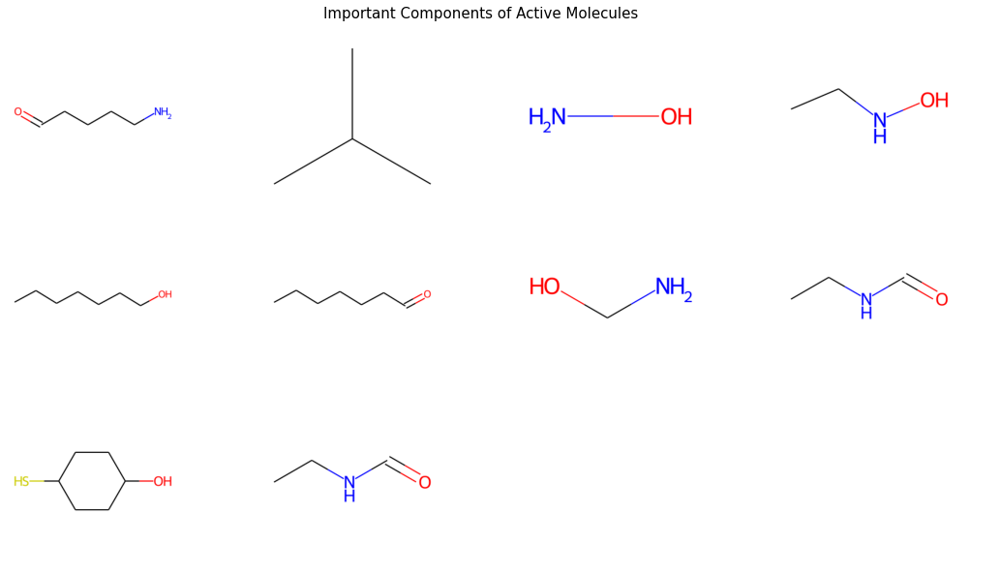

# MMP9 Drug Discovery

## Background

Machine learning is a powerful tool for the discovery of potential drug candidates. Traditional methods for screening small molecule libraries are expensive and time consuming. Additionally, only around 1-2% of the screened molecules turn out to be biologically active towards the protein of interest. Using a machine learning model to first predict which molecules are most likely to be active can significantly increase the percentage of useful molecules screened, thus decreasing the time and expense required to find potential drug candidates.

Matrix Metalloproteinases (MMPs) are a family of 24 proteins that regulate the extracellular matrix that holds cells together and keeps them in the proper place in your body. In many cancers, high levels of certain MMPs, especially MMP9, indicate that the tumor cells have been cleaved from their spot in body and are now circulating through the body, allowing the tumor to metastasize. This is correlated with a worse prognosis for the patient. Medicines that inhibit the MMPs associated with metastic tumors offer a opportunity to improve the prognosis of cancer patients.

## Business Problem

Researchers working on matrix metalloproteinases are looking for new drugs that would inhibit cancer metastisis by inhibiting MMP9 activity. To increase the effectiveness of screening a small molecule library for potential candidates, they want to first use a machine learning model to identify the compounds most likely to have inhibitory activity against the MMP9 protein before doing the more expensive and time-intensive screening for activity in vitro.

## Data 

Data for this project was obtained from the ChEMBL database. The database contained 6418 bio-active molecules that had been tested for activity on MMP9. Of these molecules, 3592 had a reported IC50 (concentration of drug required to inhibit 50% of MMP9 activity) value and were used to create the model. The data from ChEMBL contains 45 features, but I only used 3- chembl_id, canonical SMILES (a linear representation of the molecule), and the IC50 value. The IC50 value was used to create a target category- 'inactive', 'active' or 'intermediate'. Finally, the canonical SMILES was used to create a database of the compounds' PubChem fingerprints using PaDEL. The final dataset consisted of 2263 rows and 147 features representing various chemical properites of the compounds.

## Results

I used 3 different model types and stacked them for a final model that gets approximately 84% of its predictions correct. 

The top 2 rows are compound components that were important to predict activity in at least 2 models. The last row has the structures that were most important in the RandomForest (ring structure) and SVC models. The most important feature in the KNeighbors model was that compounds have four or more Nitrogens.

## Conclusion & Future Directions

Running small molecule libraries through this model before screening them in vitro will greatly increase the percentage of active molecules that are screened. This will cut down the time and cost required to find potential new cancer treatments that will inhibit MMP9 activity and impede metastasis.

There are 24 MMPs, some of which inhibit cancer and some that promote cancer. This has been an issue in previous attempts to use MMP inhibitors for cancer treatment; they weren't specific to the MMPs that promote cancer, so they affect both the good and bad MMPs with no net effect on the cancer progression. Thus, future drug candidates need to be specific against the MMPs that promote cancer. It would be useful to either build models for many of the MMP protiens and combine them to find compounds that will bind selectively or combine all the data into a multi-label classification problem.